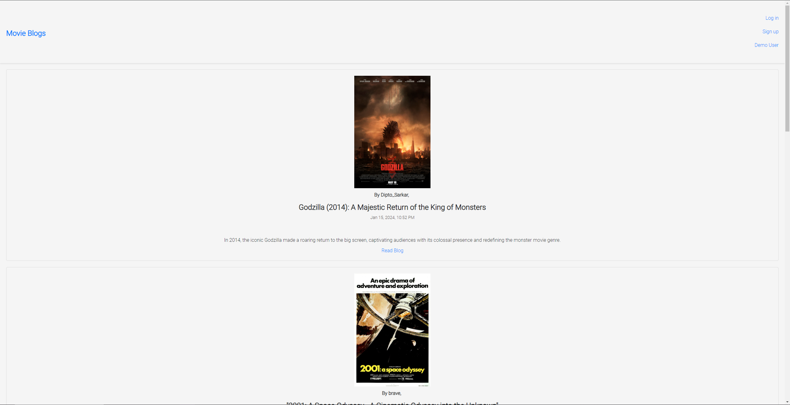
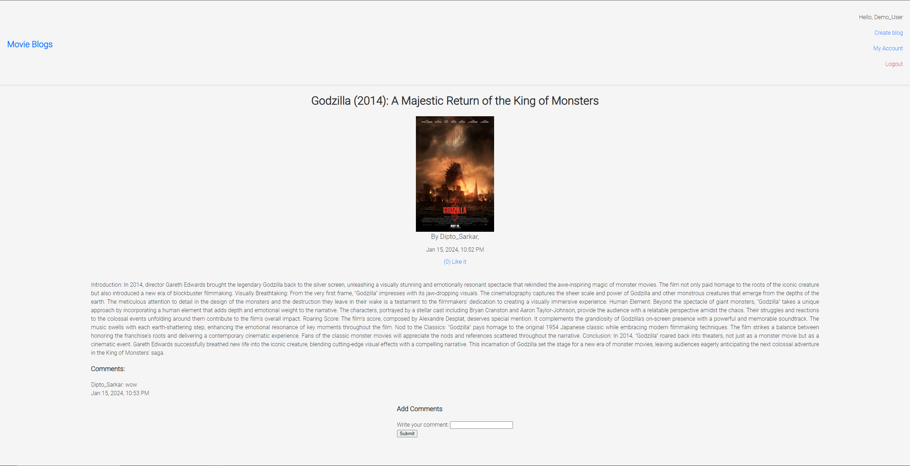

# ExpressJS Blog Website

This project is an ExpressJS-based blog website where users can perform various actions such as user registration, login, create blog posts, like posts, comment on posts, edit their own posts, delete posts, and toggle post visibility between public and private. 

Live demo on https://blog-api-ssr.onrender.com. If this link takes too long to load, try this one https://blog-api-ssr.adaptable.app/

## Screenshots




## Future Features

- Integrate a frontend framework like React or MarkoJS for enhanced UI and interactivity
- Improve the visual appeal with CSS styling to make the application look good
- Improve the error handling

## Installation

1. Clone the repository
2. Install dependencies
   ```sh
   npm install
   ```
3. Create a `.env` file in the root directory and add the following environment variables
   ```sh
    MONGODB_URI=your_mongodb_uri
    SESSION_SECRET=your_session_secret
    CLOUDINARY_NAME=your_cloudinary_name
    CLOUDINARY_API_KEY=your_cloudinary_api_key
    CLOUDINARY_API_SECRET=your_cloudinary_api_secret
    ```
4. Start the server
    ```sh
    npm run dev
    ```
5. Open your browser and navigate to `http://localhost:3000`